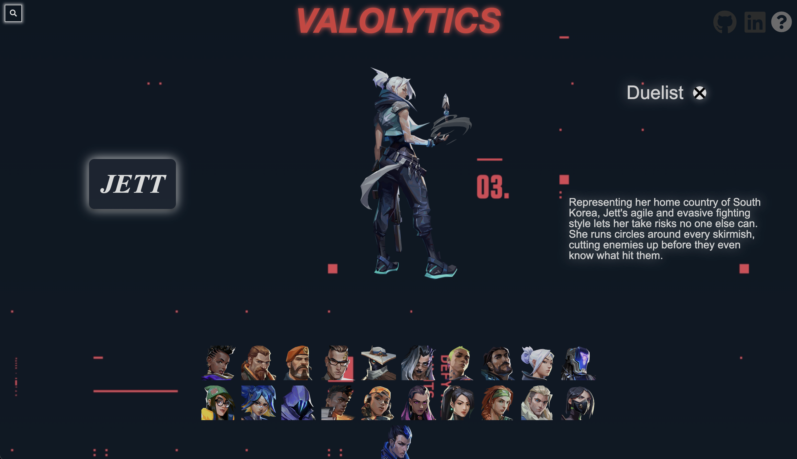
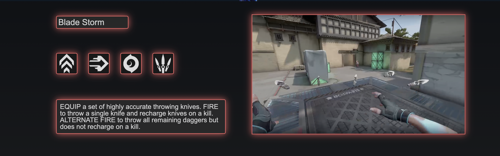
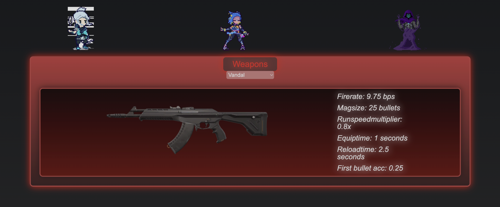
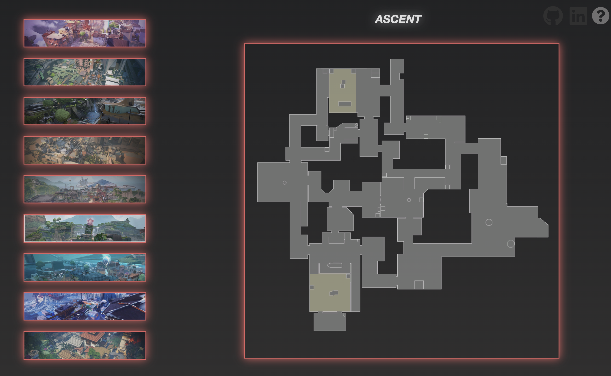

# Valolytics

Valolytics is a data visualization tool designed for the popular FPS game, Valorant. Utilizing data from Valorant-Api a custom api hosted on the web, it provides a comprehensive and insightful representation of agent role, biography, abilities, map information, and weapon statistics.

## Getting Started

The application is hosted on https://tysuiku.github.io/Valolytics/
A list of all current Valorant agents can be found at https://valorant.fandom.com/wiki/Agents

## Usage

Interact with the visualizer by clicking on the Icons displayed , resulting in real-time updates to agent's information such as abilities, and biography. The visualizer offers video demonstrations of agent abilities, as well as a section that displays valorants different maps and their layout. The search function allows for addition ease for navigation and the ability to search for all available agents.

## Data Sources

The application uses data from the Valorant-API.com to provide accurate agent information, weapon statistics, and valorant map layouts.
https://valorant-api.com/v1/agents
https://valorant-api.com/v1/weapons
https://valorant-api.com/v1/maps

## Interactive Features

- Clicking on a agent icon shows Agent background info and role.
- Video demonstrations of agent abilities (clickable icons to view the vids).
- View valorants various maps.

## Search Functionality

The search function allows for easy navigation and the ability to search for all currently available agent.
(only works on available agents)

## Future Implementations:

- Display weapon stats with in a Chart
- Add a weapon Skin view
- Add location names on the map display

## Contact Information

If you have any questions or issues, please email me at Tysuiku@gmail.com

## Screenshots

